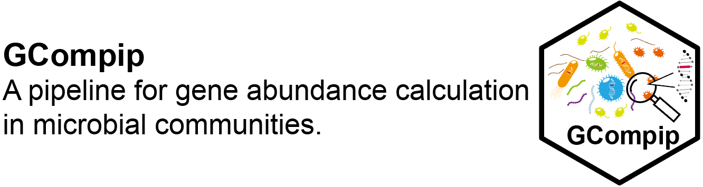

## Introduction
Metagenome collects the DNA of all the microorganisms and is critical for investigating microbial diversity and function in a particular microbial ecosystem. Gene abundance in metagenome datasets is commonly represented in terms of Reads Per Kilobase per Million mapped reads (RPKM), Fragments Per Kilobase per Million (FPKM), and Transcripts Per Million mapped reads (TPM). However, the gene abundance in microbial communities (GAM, %), defined as a specific function relative to the overall communities, remains underexplored and lacks a standardized methodology for estimation. Here, we introduced GCompip (Pipeline for Gene abundance calculation in microbial communities), a comprehensive framework for estimating GAM. This GCompip presented a robust, user-friendly and efficient computational pipeline designed to calculate GAM using metagenomic sequencing data. The developed pipeline makes it accessible to researchers seeking to evaluate the metabolic capabilities of microbial communities, and improve the capacity of interpreting metagenomic data related to microbial communities.
## The formula
GAM =  RSCG/MRUSCG*100%

## Download and Installation
### The softwares listed below must have been installed before installation :robot:
> diamond  
> seqkit  
> fastp
### The R packages listed below must have been installed before installation  
> optparse  
> dplyr  
> tidyr  
> data.table  
> magrittr  
> ggplot2
### Installation
if(!require(devtools,quietly = TRUE)){  
    install.packages("devtools")  
    library(devtools)}else{  
      library(devtools)}  
devtools::install_github("https://github.com/XiangZhouCAS/GCompip")  
### Database
Ribo_14.dmnd  
hyddb_all.dmnd (Søndergaard, D., Pedersen, C. & Greening, C. HydDB: A web tool for hydrogenase classification and analysis. Sci Rep 6, 34212 (2016). https://doi.org/10.1038/srep34212)  
ter.dmnd.gz ([Hydrogen metabolism terminal enzyme's database providede by GreeningLab](https://github.com/GreeningLab/GreeningLab-database/blob/main/Original%20database%20(2020)))

## Functions' details
### uscg_rpkm()
- `uscg_rpkm()` To calculate RPKM of universal single copy genes (RUSCG).

| Parameter | Description |
|-------|-------|
|`input_reads`|Please set the directory of reads.|
|`result`|Set the result file name.|
|`threads`|Set the threads of CPU,default is 1.|
|`UCSG_db`|Set the directory of universal single copy genes (USCGs) database.|
|`skip_fastp`|If you have already filtered the reads, you can set this parameter to skip running fastp. The default is to run fastp.|
|`min_length`|Set the minimum length required for filtering reads, the default is 100.|
|`run_seqkit`|If you have already counted the total number of reads using seqkit, you can specify the directory of the seqkit results (e.g., 'sample_name.all.reads.txt') to skip running seqkit. By default, seqkit will be executed.|
|`keep_samples`|By default, the temporary results will be deleted unless this parameter is setted.|

#### Example

```
uscg_rpkm(input_reads = "your/reads/data/sample_1.fastq",result = "sample_1",threads = 40,USCG_db = "your/database/Ribo_14.dmnd",skip_fastp = F,min_length = 75,run_seqkit = T,keep_samples = F)
```

### uscg_rpkm()
- `uscg_rpkm2GAM()` To convert RPKM to GAM of genes from geneset.

| Parameter | Description |
|-------|-------|
|`input_geneset`|Please set the directory of geneset RPKM abundance file.|
|`input_ribo_rpkm`|Please set the directory of USCGs' RPKM file e.g.,ribo_rpkm.txt.|
|`output`|Please set the directory of output.|

#### Example
```
uscg_rpkm2GAM(input_geneset = "your/data/geneset.RPKM.txt",input_uscg_rpkm = "your/database/RUSCG.txt",output = "geneset.GAM.txt")
```
### diamond_GAM()
- `diamond_GAM()` To calculate the GAM.

| Parameter | Description |
|-------|-------|
|`input_reads`|Please set the reads to include only the forward reads if the data is paired-end (PE).|
|`result`|Please set the name for the result file.|
|`threads`|Set the number of CPU threads, with the default value being 1.|
|`Gene_db`|Set the directory of universal single copy genes (USCGs) database.|
|`UCSG_db`|Please specify the directory for universal single-copy genes database (e.g., 'Ribo_14.dmnd'). If you have already calculated the RPKM for these genes, you may instead specify the directory for the results (e.g., 'sample_name.UCSG.hits.txt') to skip this step.|
|`skip_fastp`|If you have already filtered the reads, you can set this parameter to skip running fastp. The default is to run fastp.|
|`min_length`|Set the minimum length required for filtering reads, the default is 100, but it is recommended to set this parameter to 140 if hydrogenases or hydrogen metabolism terminal enzymes are to be calculated.|
|`run_seqkit`|If you have already counted the total number of reads using seqkit, you can specify the directory of the seqkit results (e.g., 'sample_name.all.reads.txt') to skip running seqkit. By default, seqkit will be executed.|
|`filter_condition`|Please specify the filter_condition file. By default, the identity is set to 50 and the coverage to 80.|
|`keep_samples`|By default, the temporary results will be deleted unless this parameter is setted.|

#### Example
```
diamond_GAM(input_reads = "your/reads/data/sample_1.fastq",result = "sample_1",threads = 40,Gene_db = "your/database/ter_hydB-aprA.dmnd",USCG_db = "your/database/Ribo_14.dmnd",min_length = 75,filter_condition = "default")
```
#### Note
filter condition file demo:

| gene | identity | coverage |
|-------|-------|-------|
|gene1|50|80|
|gene2|50|80|
|gene3|60|80|
|...|...|...|

### ter.diamond_GAM()
- `ter.diamond_GAM()` To calculate the hydrogen metabolism terminal gene's GAM.

| Parameter | Description |
|-------|-------|
|`input_reads`|Please set the reads to include only the forward reads if the data is paired-end (PE).|
|`result`|Please set the name for the result file.|
|`threads`|Set the number of CPU threads, with the default value being 1.|
|`ter_db`|Set the directory of universal single copy genes (USCGs) database.|
|`UCSG_db`|Please specify the directory for universal single-copy genes database (e.g., 'Ribo_14.dmnd'). If you have already calculated the RPKM for these genes, you may instead specify the directory for the results (e.g., 'sample_name.UCSG.hits.txt') to skip this step.|
|`skip_fastp`|If you have already filtered the reads, you can set this parameter to skip running fastp. The default is to run fastp.|
|`min_length`|Set the minimum length required for filtering reads, the default is 100, but it is recommended to set this parameter to 140 if hydrogenases or hydrogen metabolism terminal enzymes are to be calculated.|
|`run_seqkit`|If you have already counted the total number of reads using seqkit, you can specify the directory of the seqkit results (e.g., 'sample_name.all.reads.txt') to skip running seqkit. By default, seqkit will be executed.|
|`keep_samples`|By default, the temporary results will be deleted unless this parameter is setted.|

#### Example
```
ter.diamond_GAM(input_reads = "your/reads/data/sample_1.fastq",result = "sample_1",threads = 40,ter_db = "your/database/ter.dmnd",USCG_db = "your/database/Ribo_14.dmnd",min_length = 75)
```

### hyd.diamond_GAM()
- `hyd.diamond_GAM()` To calculate Hydrogenase's GAM.

| Parameter | Description |
|-------|-------|
|`input_reads`|Please set the reads to include only the forward reads if the data is paired-end (PE).|
|`result`|Please set the name for the result file.|
|`threads`|Set the number of CPU threads, with the default value being 1.|
|`hyd_db`|Set the directory of hydrogenases' genes database.|
|`UCSG_db`|Please specify the directory for universal single-copy genes database (e.g., 'Ribo_14.dmnd'). If you have already calculated the RPKM for these genes, you may instead specify the directory for the results (e.g., 'sample_name.UCSG.hits.txt') to skip this step.|
|`script`|Please set the directory of hyd_id-name.script.|
|`skip_fastp`|If you have already filtered the reads, you can set this parameter to skip running fastp. The default is to run fastp.|
|`min_length`|Set the minimum length required for filtering reads, the default is 100, but it is recommended to set this parameter to 140 if hydrogenases or hydrogen metabolism terminal enzymes are to be calculated.|
|`run_seqkit`|If you have already counted the total number of reads using seqkit, you can specify the directory of the seqkit results (e.g., 'sample_name.all.reads.txt') to skip running seqkit. By default, seqkit will be executed.|
|`keep_samples`|By default, the temporary results will be deleted unless this parameter is setted.|

#### Example
```
hyd.diamond_GAM(input_reads = "your/reads/data/sample_1.fastq",result = "sample_1",threads = 40,hyd_db = "your/database/hyddb.all.dmnd",USCG_db = "your/database/Ribo_14.dmnd",script = "your/database/hyd_id-name.script",min_length = 75)
```

### Database_download()
- `Database_download()` To download databases if you need.

| Parameter | Description |
|-------|-------|
|`db_filepath`|Set the download filepath.|
|`db_type`|Select the type of database to download.|

#### Example
```
Database_download(db_filepath = "your/database/filepath",db_type = "USCG")
```